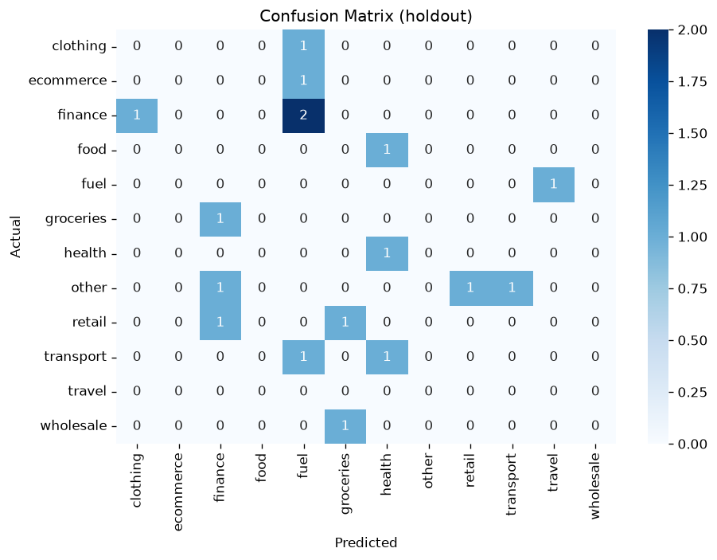

# Product Recommendation — Evaluation Report

Generated by `notebooks/02_product_recommendation.ipynb`.

## Dataset statistics

| Item | Value |
|------|-------|
| Source file | `modeling_dataset.csv` |
| Rows (customers) | 84 |
| Features used | 6 |
| Classes | 12 |
| Train / test size | 67 / 17 |
| Random state | 42 |

### Class distribution

```
product_category
other        15
finance      14
retail        9
transport     9
clothing      7
ecommerce     6
fuel          5
health        5
food          5
groceries     4
wholesale     3
travel        2
```

## Holdout metrics

| Metric | Value |
|--------|-------|
| Accuracy | 0.0588 |
| Precision (macro) | 0.0278 |
| Recall (macro) | 0.0833 |
| F1 (macro) | 0.0417 |
| F1 (weighted) | 0.0294 |
| ROC-AUC (OvR macro) | 0.5348 |

> OvR macro AUC over the 11 classes present in holdout (absent from holdout: ['travel']). Probabilities renormalized over present classes only.
| Log loss | 4.6196 |


## Cross-validation (StratifiedKFold, n_splits=2)

| Metric | Fold scores | Mean | Std |
|--------|-------------|------|-----|
| Accuracy | [0.119, 0.0952] | 0.1071 | 0.0119 |
| F1 (macro) | [0.1229, 0.0559] | 0.0894 | 0.0335 |

## Classification report

```
              precision    recall  f1-score   support

    clothing       0.00      0.00      0.00         1
   ecommerce       0.00      0.00      0.00         1
     finance       0.00      0.00      0.00         3
        food       0.00      0.00      0.00         1
        fuel       0.00      0.00      0.00         1
   groceries       0.00      0.00      0.00         1
      health       0.33      1.00      0.50         1
       other       0.00      0.00      0.00         3
      retail       0.00      0.00      0.00         2
   transport       0.00      0.00      0.00         2
      travel       0.00      0.00      0.00         0
   wholesale       0.00      0.00      0.00         1

    accuracy                           0.06        17
   macro avg       0.03      0.08      0.04        17
weighted avg       0.02      0.06      0.03        17

```

## Confusion matrix



```
           clothing  ecommerce  finance  food  fuel  groceries  health  other  retail  transport  travel  wholesale
clothing          0          0        0     0     1          0       0      0       0          0       0          0
ecommerce         0          0        0     0     1          0       0      0       0          0       0          0
finance           1          0        0     0     2          0       0      0       0          0       0          0
food              0          0        0     0     0          0       1      0       0          0       0          0
fuel              0          0        0     0     0          0       0      0       0          0       1          0
groceries         0          0        1     0     0          0       0      0       0          0       0          0
health            0          0        0     0     0          0       1      0       0          0       0          0
other             0          0        1     0     0          0       0      0       1          1       0          0
retail            0          0        1     0     0          1       0      0       0          0       0          0
transport         0          0        0     0     1          0       1      0       0          0       0          0
travel            0          0        0     0     0          0       0      0       0          0       0          0
wholesale         0          0        0     0     0          1       0      0       0          0       0          0
```

## Feature importance (top 25)

| Feature | Importance |
|---------|------------|
| `num__engagement_score` | 0.2028 |
| `num__average_engagement` | 0.2016 |
| `num__purchase_interest_score` | 0.1946 |
| `num__platform_count` | 0.0817 |
| `cat__main_platform_linkedin` | 0.0541 |
| `cat__review_sentiment_positive` | 0.0482 |
| `cat__main_platform_tiktok` | 0.0455 |
| `cat__main_platform_instagram` | 0.0380 |
| `cat__review_sentiment_negative` | 0.0361 |
| `cat__main_platform_twitter` | 0.0355 |
| `cat__review_sentiment_neutral` | 0.0344 |
| `cat__main_platform_facebook` | 0.0274 |

## Notes

- Features are **social signals only**; RFM / `fraud_rate` are excluded to avoid target leakage.
- Training frame is **one row per customer** (`modeling_dataset.csv`).
- Multiclass ROC-AUC uses One-vs-Rest (`multi_class='ovr'`, macro average).
- Log loss uses predicted class probabilities from `RandomForestClassifier.predict_proba`.
