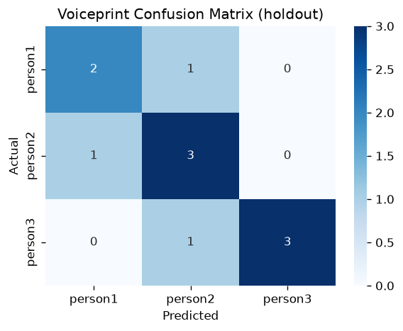

# Voiceprint Verification — Evaluation Report

Generated by `notebooks/03_voice_verification.ipynb`.

## Dataset statistics

| Item | Value |
|------|-------|
| Source file | `audio_features.csv` |
| Rows (voice samples) | 42 |
| Features used | 30 |
| Voiceprint classes (members) | 3 |
| Train / test size | 31 / 11 |
| Random state | 42 |

### Samples per voiceprint

```
person_id
person1    14
person2    14
person3    14
```

## Holdout metrics

| Metric | Value |
|--------|-------|
| Accuracy | 0.7273 |
| F1 (macro) | 0.7302 |
| F1 (weighted) | 0.7359 |
| Loss (log_loss) | 0.6844 |


## Cross-validation (StratifiedKFold, n_splits=3)

| Metric | Fold scores | Mean | Std |
|--------|-------------|------|-----|
| Accuracy | [0.6429, 0.7857, 0.7143] | 0.7143 | 0.0583 |
| F1 (macro) | [0.6633, 0.7778, 0.7] | 0.7137 | 0.0477 |

## Classification report

```
              precision    recall  f1-score   support

     person1       0.67      0.67      0.67         3
     person2       0.60      0.75      0.67         4
     person3       1.00      0.75      0.86         4

    accuracy                           0.73        11
   macro avg       0.76      0.72      0.73        11
weighted avg       0.76      0.73      0.74        11

```

## Confusion matrix



```
         person1  person2  person3
person1        2        1        0
person2        1        3        0
person3        0        1        3
```

## Feature importance (top 20)

| Feature | Importance |
|---------|------------|
| `mfcc5_mean` | 0.1225 |
| `mfcc11_std` | 0.1023 |
| `mfcc9_mean` | 0.0758 |
| `mfcc10_std` | 0.0656 |
| `mfcc12_std` | 0.0436 |
| `mfcc2_std` | 0.0429 |
| `mfcc1_std` | 0.0420 |
| `spectral_rolloff_std` | 0.0408 |
| `mfcc2_mean` | 0.0380 |
| `energy_std` | 0.0370 |
| `mfcc9_std` | 0.0335 |
| `mfcc4_std` | 0.0264 |
| `mfcc12_mean` | 0.0264 |
| `mfcc3_mean` | 0.0239 |
| `mfcc13_mean` | 0.0227 |
| `mfcc6_std` | 0.0212 |
| `mfcc13_std` | 0.0212 |
| `mfcc1_mean` | 0.0201 |
| `spectral_rolloff_mean` | 0.0192 |
| `energy_mean` | 0.0185 |

## Notes

- Target is `person_id` (voiceprint identity), not `customer_id` — `audio_features.csv`
  uses its own `C0xx` customer IDs (see README limitations) until linked to tabular IDs.
- Each member contributes 2 phrases x 7 variants (original + pitch up/down +
  stretch fast/slow + noise low/high) = 14 samples.
- Small sample size ⇒ metrics are illustrative of the pipeline, not production-grade accuracy.
