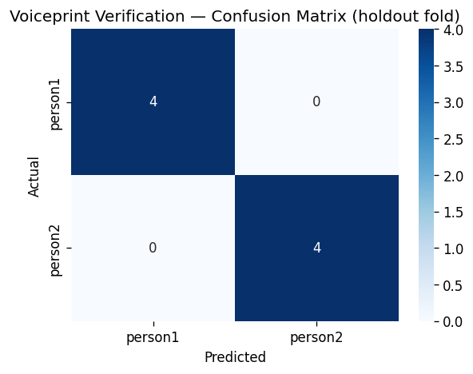

# Voiceprint Verification — Evaluation Report

Generated by `notebooks/04_voiceprint_verification.ipynb`.

## Dataset statistics

| Item | Value |
|------|-------|
| Source file | `audio_features.csv` |
| Rows (audio variants) | 16 |
| Unique source recordings (groups) | 4 |
| Known people | 2 (person1, person2) |
| Feature dimensions | 17 |
| CV folds | 2 (StratifiedGroupKFold, grouped by Person+Phrase recording) |
| Unknown threshold | 0.6 |

## Cross-validation (grouped, every recording rotates through test)

| Metric | Fold scores | Mean | Std |
|--------|-------------|------|-----|
| Accuracy | [1.0, 0.875] | 0.9375 | 0.0625 |
| F1 (macro) | [1.0, 0.873] | 0.9365 | 0.0635 |

## Holdout metrics (fold 0)

| Metric | Value |
|--------|-------|
| Accuracy | 1.0000 |
| F1 (macro) | 1.0000 |
| F1 (weighted) | 1.0000 |
| Log loss | 0.0300 |

## Classification report (holdout fold)

```
              precision    recall  f1-score   support

     person1       1.00      1.00      1.00         4
     person2       1.00      1.00      1.00         4

    accuracy                           1.00         8
   macro avg       1.00      1.00      1.00         8
weighted avg       1.00      1.00      1.00         8

```

## Confusion matrix



## Unknown / unauthorized handling

Predictions with max class probability below `0.6` are rejected as `UNKNOWN`
rather than forced to the nearest known class. On this holdout fold (every row belongs to a
known person), 0/8 predictions were rejected — expected to be low or
zero, since none of these test rows are genuinely unauthorized. True unauthorized-attempt
behavior (a voice never seen during training) is exercised in the Task 6 CLI demo, not in
this dataset.

## Notes

- **Identification, not open-set verification**: the model classifies "which known person",
  with unknown-identity rejection handled via the probability threshold above rather than
  learned from negative examples.
- **Group-aware evaluation**: augmented variants (pitch-shift/time-stretch/noise) of the
  same recording are kept together on one side of every split, so metrics reflect
  generalization to a new recording rather than a transformed duplicate of a training clip.
- **Small-N caveat**: only 4 source recordings across
  2 people. Metrics are directional, not production-grade.
